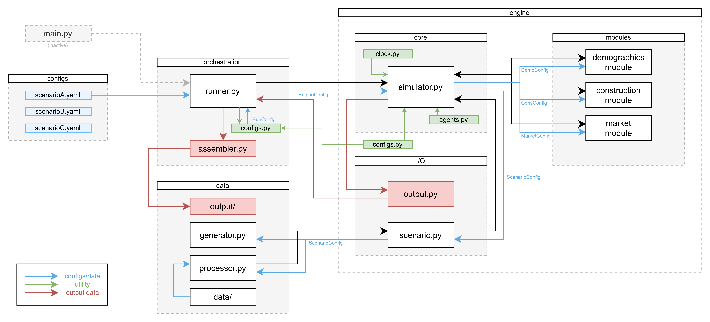

# Architecture

## Module Overview

## Layers

### `configs/`
YAML files that define a run. Each file maps to the Pydantic schema in `orchestration/config.py`.

### `orchestration/`
Owns the run lifecycle. `runner.py` loads the config, drives the simulator, and delegates output aggregation to `assembler.py`. `configs.py` holds `RunConfig` and `load_config`. It is the only place that reads YAML.

### `engine/`
The simulation core. Knows nothing about how it was launched or how results are stored.

- **`config.py`** — `EngineConfig` and all sub-configs (sim, scenario, modules, output). The boundary between orchestration and engine.
- **`core/`** — `simulator.py` holds the simulation; `clock.py` tracks simulation time; `agents.py` defines agent types.
- **`modules/`** — demographics, construction, and market sub-models. Each receives its own config slice.
- **`io/`** — `scenario.py` loads the initial scenario (real or synthetic); `output.py` writes snapshots.

### `data/`
All data lives here — real input data, synthetic generation recipes, and run outputs.

- **`generator.py`** — produces a synthetic `Scenario` from a recipe.
- **`processor.py`** — cleans and loads real data files.
- **`output/`** — written by `engine/io/output.py` at the cadence set in `OutputConfig`.
